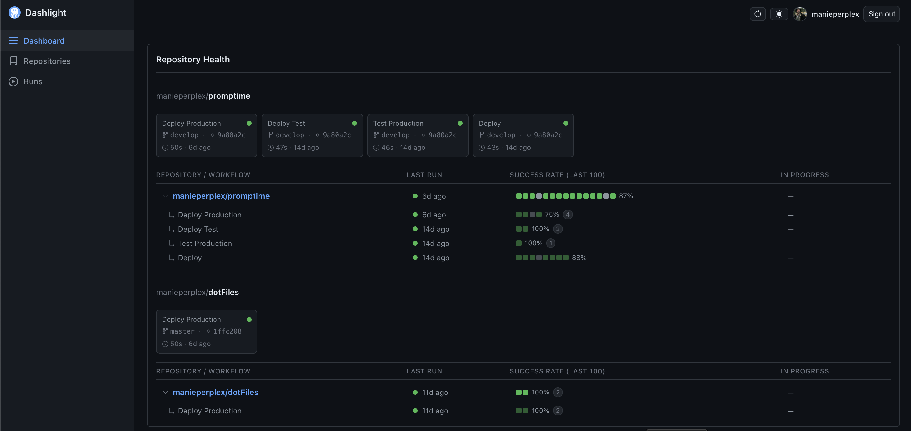

# Dashlight

A self-hosted CI/CD visibility dashboard for GitHub Actions. One screen showing workflow runs, job status, and repository health across all your repos — without jumping between GitHub pages. Filter runs by branch or status, drill into individual job logs, and track a health score per repository based on recent run outcomes. Works across personal repos and organisation repos from a single login.

**No database. Two Docker containers. Your GitHub token never touches the browser.**

<br>



## How it works

- You sign in with GitHub OAuth. The server exchanges the code for a token and keeps it in memory — only an opaque session cookie reaches your browser.
- All GitHub API calls go through the server proxy, which caches responses in an LRU store (2 min for runs, 7 days for immutable data).
- The React frontend caches query results in IndexedDB so data survives page reloads.
- Polling replaces WebSockets: active pipelines refresh every 30 s, summaries every 60 s.

---

## Requirements

- Docker + Docker Compose
- A GitHub OAuth App ([create one here](https://github.com/settings/developers))
  - Set the **Authorization callback URL** to `http://your-host:5174/auth/callback`
  - (Port `5174` is the nginx container — the server is not publicly exposed)

---

## Setup

**1. Create a GitHub OAuth App**

Go to [github.com/settings/developers](https://github.com/settings/developers) → New OAuth App.

| Field | Value |
|---|---|
| Application name | Dashlight (or anything) |
| Homepage URL | `http://your-host:5174` |
| Authorization callback URL | `http://your-host:5174/auth/callback` |

Copy the **Client ID** and generate a **Client Secret**.

**2. Clone and configure**

```bash
git clone <repo-url> dashlight
cd dashlight
cp env.example .env
```

Edit `.env` and fill in the three required values:

```env
GITHUB_CLIENT_ID=your_oauth_app_client_id
GITHUB_CLIENT_SECRET=your_oauth_app_client_secret
SESSION_SECRET=a-random-string-of-at-least-32-characters
```

Generate a session secret:

```bash
openssl rand -base64 32
```

**3. (Optional) Scope repositories**

By default all repos the authenticated user can access are shown. To restrict:

```env
# Show only repos in one org
GITHUB_ORG=my-company

# Or show only specific repos (takes precedence over GITHUB_ORG)
GITHUB_REPOS=my-company/api,my-company/web
```

**4. Build and start**

```bash
docker compose up --build
```

First build takes a few minutes (installs dependencies, compiles TypeScript, builds the React SPA). Subsequent starts are fast.

Open `http://localhost:5174` and sign in with GitHub.

**5. Run in the background**

```bash
docker compose up -d --build
docker compose logs -f          # follow logs
docker compose down             # stop
```

**Updating to a new version**

```bash
git pull
docker compose up --build -d
```

---

## Configuration

All variables are set in `.env` (copy from `env.example`).

| Variable | Default | Description |
|---|---|---|
| `GITHUB_CLIENT_ID` | — | **Required.** OAuth App client ID |
| `GITHUB_CLIENT_SECRET` | — | **Required.** OAuth App client secret |
| `SESSION_SECRET` | — | **Required.** Min 32 chars, random |
| `GITHUB_ORG` | — | Show only repos in this org |
| `GITHUB_REPOS` | — | Show only these repos (comma-separated `owner/repo`). Takes precedence over `GITHUB_ORG` |
| `GITHUB_SCOPE` | — | OAuth scopes to request (leave blank for the built-in default) |
| `WEB_PORT` | `5174` | Host port for the nginx container |
| `FRONTEND_URL` | `http://localhost:5174` | Public URL of the app — must match where users open it |
| `PORT` | `8080` | Internal server listen port (not exposed publicly) |
| `LOG_LEVEL` | `info` | Server log verbosity: `debug` \| `info` \| `warn` \| `error` |
| `CACHE_MAX_SIZE_MB` | `128` | In-memory LRU cache limit |
| `EXTRA_CA_CERTS_B64` | — | Build-time only. Base64-encoded PEM bundle injected into the image during `docker compose build`. See [Corporate CA certificate](#corporate-ca-certificate). |
| `HTTPS_PROXY` / `HTTP_PROXY` | — | Corporate HTTP proxy for outbound requests to `api.github.com` |
| `NO_PROXY` | — | Comma-separated hosts to bypass the proxy |
| `TRUST_PROXY` | `true` | Trust `X-Forwarded-For` from nginx for rate limiting (set by Compose automatically) |
| `COOKIE_SECURE` | `false` | Set to `true` when serving over HTTPS to enable the `Secure` cookie flag |

### GitHub OAuth scopes

When you sign in, Dashlight requests these OAuth scopes:

| Scope | Why it is needed |
|---|---|
| `repo` | Read private repositories and manage workflow runs (re-run, cancel). GitHub offers no narrower scope that covers private repo access — `repo` is the minimum required. |
| `read:org` | Read organisation membership, required when `GITHUB_ORG` is set or when listing org repos. |
| `read:user` | Read basic profile data (name, avatar) shown in the UI. |
| `user:email` | Read the account email address. |

**Why `repo` grants write access**

The `repo` scope is GitHub's all-or-nothing scope for private repositories — it includes both read and write. There is no GitHub scope that grants only read access to private repos. The write capability is a consequence of how GitHub's scope model works, not a Dashlight design choice.

The only write operations Dashlight performs are triggering workflow reruns and cancelling in-progress runs — both initiated explicitly by the user through the UI. No code, settings, or repository data is ever modified.

If you only use public repositories, you can override the default scope to remove `repo`:

```env
GITHUB_SCOPE=read:user,user:email,read:org,public_repo
```

**Organisation repos and SAML SSO**

`GITHUB_REPOS=myorg/repo1,myorg/repo2` works for organisation repos without any extra scopes — the `repo` scope covers both personal and organisation private repos the user has access to. `GITHUB_ORG=myorg` works the same way.

If the organisation enforces SAML SSO, the user must additionally click **Authorize** next to the org name on GitHub's OAuth authorization screen. Without this, GitHub returns 403 for all org resources regardless of granted scopes. There is no server-side workaround — it must be done by each user at login time.

### Changing the port

Set `WEB_PORT` and update `FRONTEND_URL` to match:

```env
WEB_PORT=8443
FRONTEND_URL=http://your-server:8443
```

Also update the GitHub OAuth App callback URL to `http://your-server:8443/auth/callback`.

### HTTPS deployment

When serving Dashlight over HTTPS (e.g. behind Caddy, Traefik, or nginx), update three things:

**1. `.env`**

```env
FRONTEND_URL=https://your-domain.com
COOKIE_SECURE=true
```

**2. GitHub OAuth App callback URL**

Update the Authorization callback URL to `https://your-domain.com/auth/callback`.

**3. `WEB_PORT` (optional)**

If your reverse proxy terminates TLS and forwards to port 80 of the `web` container, you can keep `WEB_PORT=80` internally and let the proxy handle 443.

> `TRUST_PROXY` is already hardcoded to `true` in `docker-compose.yml` (nginx sets `X-Forwarded-For` reliably). The value in `.env` is not used when running via Compose.

---

### Corporate CA certificate

If your Docker build environment intercepts outbound TLS (e.g. corporate proxy), you must inject the CA bundle at **build time** so that `pnpm install` and `tsc` can reach the registry.

The certificate is baked into the image during `docker compose build` — it is not a runtime environment variable and does not need to be passed when starting containers.

**Single certificate**

```bash
# Encode the PEM file
# macOS
base64 < my-ca.pem > /tmp/bundle.b64

# Linux (suppress line wrapping — required for Docker build args)
base64 -w0 < my-ca.pem > /tmp/bundle.b64

# Write the build-arg env file
echo "EXTRA_CA_CERTS_B64=$(cat /tmp/bundle.b64)" > .docker-certs.env
```

**Multiple certificates**

Concatenate all PEM files into one bundle before encoding — the Dockerfile appends the entire bundle to the system root store, so all CAs in the bundle will be trusted:

```bash
# Concatenate and encode
# macOS
cat ca-1.pem ca-2.pem ca-3.pem | base64 > /tmp/bundle.b64

# Linux
cat ca-1.pem ca-2.pem ca-3.pem | base64 -w0 > /tmp/bundle.b64

# Write the build-arg env file
echo "EXTRA_CA_CERTS_B64=$(cat /tmp/bundle.b64)" > .docker-certs.env
```

**Build and run**

```bash
# Build only
docker compose --env-file .env --env-file .docker-certs.env build

# Build + start in one go
docker compose --env-file .env --env-file .docker-certs.env up -d
```

> `.docker-certs.env` is gitignored — never commit it. It contains your CA certificates encoded as base64.

If the build environment does **not** intercept TLS (home network, CI with public access), omit `--env-file .docker-certs.env` entirely — the build proceeds with the base image trust store only.

---

## Troubleshooting

**Login fails with "redirect_uri_mismatch"**
The Authorization callback URL in your GitHub OAuth App does not match where Dashlight is running. It must be exactly `http(s)://your-host:port/auth/callback`. Update it at [github.com/settings/developers](https://github.com/settings/developers).

**Blank page or redirect loop after login**
`FRONTEND_URL` doesn't match the URL you opened in the browser. They must be identical (same scheme, host, and port). Update `.env` and restart.

**Session cookie not sent / 401 on every request**
If serving over HTTPS, ensure `COOKIE_SECURE=true`. If the browser blocks the cookie, check that `FRONTEND_URL` uses `https://` and that your reverse proxy forwards `X-Forwarded-Proto`.

**No repositories shown**
Check `GITHUB_REPOS` and `GITHUB_ORG` in `.env`. If both are unset, all repos the signed-in user can access are shown — verify the OAuth token has the `repo` scope. Organisation repos also require the user to have authorised the OAuth App for that org (SAML SSO orgs need an extra "Authorize" step on GitHub's OAuth screen).

**`docker compose up` appears to hang**
The `web` container waits for the `server` container to pass its health check before starting. If the server exits immediately (missing required env var, bad `SESSION_SECRET`), run `docker compose logs server` to see the startup error.

**GitHub API calls fail in a corporate network**
Set `HTTPS_PROXY` (and optionally `HTTP_PROXY`, `NO_PROXY`) in `.env`. These are passed to the server at runtime for all outbound calls to `api.github.com`. If the corporate proxy uses a private CA, inject it at build time via `EXTRA_CA_CERTS_B64` (see [Corporate CA certificate](#corporate-ca-certificate)).

---

## Development

```bash
pnpm install
```

Copy `env.example` to `.env` and fill in the three required values (`GITHUB_CLIENT_ID`, `GITHUB_CLIENT_SECRET`, `SESSION_SECRET`). The dev server reads `.env` at startup.

```bash
# Run both packages in watch mode
pnpm dev
```

- Server: `http://localhost:8080`
- Web (Vite dev server): `http://localhost:5174` — proxies `/auth`, `/proxy`, `/api`, `/system` to the server automatically.

**Type check + test:**

```bash
pnpm typecheck
pnpm test
```

---

## Architecture

```
Browser
  └── React SPA (TanStack Router + React Query, IndexedDB persistence)
       │  all requests to same origin — no CORS
       ▼
nginx (port 5174)
  ├── /* (static)              → serve React SPA from /usr/share/nginx/html
  └── /auth|api|proxy|system/* → proxy_pass → Hono Server (internal)
       │  cookie: session=<signed JWT>  (HttpOnly, no token inside)
       ▼
Hono Server (Node 22, internal only)
  ├── /auth/*     — GitHub OAuth flow, session management
  ├── /proxy/*    — Authenticated GitHub API proxy (LRU cache)
  ├── /api/score  — Repository health scoring (7 categories)
  └── /system/*   — Health check
       │
       ▼
GitHub API
```

**Scores** are computed lazily when you navigate to a repository detail page (not on dashboard load). Results are cached for 24 hours. Seven categories: Community Health, Branch Protection, CI/CD Workflows, Build Success Rate, Security Practices, Documentation, Maintenance.

---

## Project layout

```
packages/
  server/   — Hono TypeScript server
  web/      — React 19 frontend
docker-compose.yml
env.example
```
